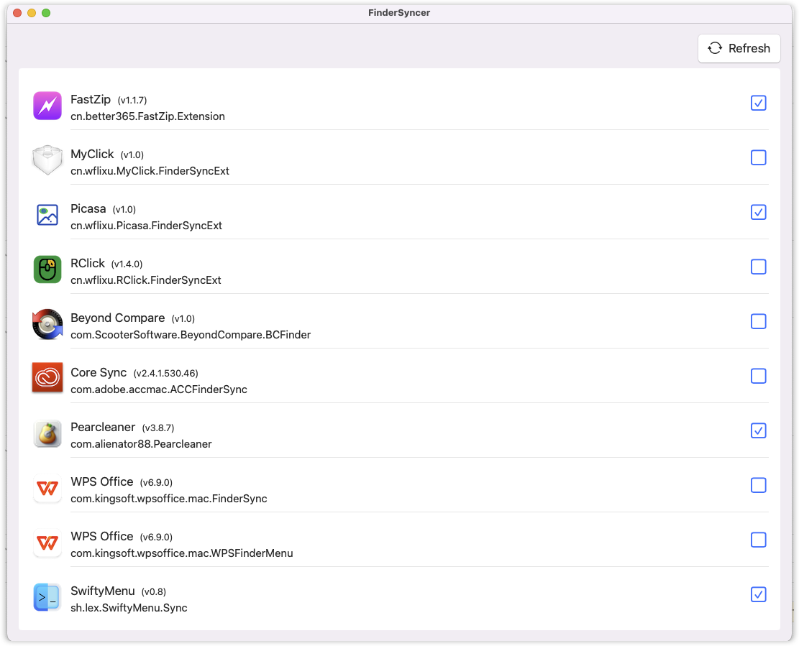

# FinderSyncer

FinderSyncer is a macOS app that enable you finder sync extension for macOS 15. In macOS 15, Apple removed the Finder Sync extension configuration interface, which makes it difficult for users to manage their Finder Sync settings. 

## Download

You can download the latest release from the [releases page](https://github.com/wflixu/FinderSyncer/releases).

## Preview

A Screenshot of the app:

## license

macOS FinderSyncer is released under the MIT license.
